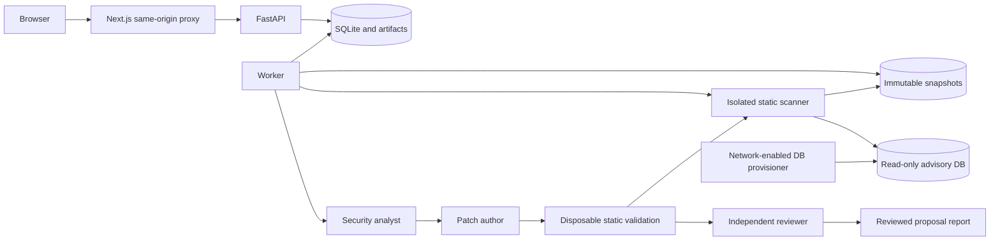

# Runtime architecture

CodeAgent uses a bounded, persisted workflow on one host. Its agents are separate model invocations with typed responsibilities; an additional agent framework or distributed queue is not required for this scale. SQLite stores job claims, worker leases, events, settings, static checkpoints, and review checkpoints. Filesystem volumes store immutable snapshots and versioned reports.

## Services and trust boundaries

The UI proxies the API on the same origin; the browser never receives API/provider credentials. API and worker share the runtime-data and source-snapshots volumes. Snapshot files are hashed and not edited by the workflow. The API validates source requests and enqueues jobs; a separate worker claims them with an expiring lease and a fresh token for each claim. Publication checks that token so an expired attempt cannot overwrite a newer attempt, even on the same worker. SQLite applies the additive lease ownership migration to existing workspaces. Concurrency is bounded by `MAX_CONCURRENT_JOBS` on this single-host installation.

The scanner exposes an internal RPC only. It mounts source snapshots and advisory data read-only, has no provider or GitHub credentials, runs as a nonroot user with Linux capabilities dropped, and connects only to an internal Docker network. It can write temporary files in tmpfs. Repository configuration cannot redirect Semgrep or Trivy into fetching rules or ignoring findings. Scanner adapters invoke only installed, pinned engines against source files; .NET analysis parses source using trusted compiler services and does not run MSBuild, restore packages, load repository assemblies, or run uploaded code.

The advisory provisioner has network access and writes the vulnerability DB before the scanner starts. The scanner itself disables advisory/check updates and telemetry. Network-enabled API/worker services acquire GitHub source archives and make explicitly configured provider requests. This isolates untrusted parsing from application secrets without requiring Docker socket access or privileged containers.

## Persistent state and recovery

A scan progresses through acquisition, snapshotting, static analysis, report publication, and an optional child review. Each review pins an immutable version of its input static report under `report_versions/{scan_id}/{report_hash}.json`, so a later scan retry cannot change the evidence for an earlier review. That report hash participates in review deduplication, and the UI displays the selected review's frozen findings. Completed analyzer checkpoints can be reused on scan retry. Review runs have their own job identity, selected provider/model/configuration, event stream, checkpoints, and artifact.

Each agent step records its role, status, input hash, typed output, usage, timing, and error. A completed checkpoint is reused only when its input hash matches. The worker records a running step before submitting an external request. If a process disappears during a model request, recovery marks the review interrupted; it does not silently repeat the call. Explicit Retry authorizes resubmission of the uncertain step and retains completed valid work. The provider may already have billed a lost response, so checkpointing cannot promise exactly-once external generation.

Cancellation is cooperative between stages and during engine/provider operations. A report can be complete, partial, or failed; jobs also expose queued, running, canceled, and interrupted states. Errors, skipped coverage, and completed work from interrupted reviews remain visible as partial artifacts. Retry resumes the same job/source; rerun starts a fresh scan. Retention deletes expired source snapshots separately from longer-lived reports, preventing later source-dependent actions from silently operating on missing or different content.

## Agent workflow

The analyst receives at most five related findings and bounded source evidence, with a separate validated triage decision for every occurrence ID. A cached identifier/location index prioritizes scanner traces and labels lexical caller matches as candidates. Findings are not merged on proximity alone. Each role invocation can request approved read/search context operations for at most two retrieval rounds. These operations read regular files beneath the immutable snapshot, enforce path and context-size limits, and return evidence with file hashes. They never execute repository instructions. Language-neutral text retrieval keeps the workflow usable for every supported source language without claiming compiler-level semantics from retrieval alone.

The author receives the finding, triage, and evidence. A proposal contains exact original/replacement text and source hashes. Deterministic validation rejects unknown paths, stale hashes, ambiguous originals, overlapping edits, invalid evidence, and malformed structured output. The isolated scanner creates one disposable copy at a time, applies the edits there, and checks syntax and before/after findings with trusted profiles. Changed dependency inventories also run dependency analysis. Missing tools, parser failures, remaining targets, new findings, incompatible profiles, and timeouts cannot receive a fully validated status. Each attempt is bounded by 120 seconds and the remaining review deadline. Cancellation terminates scanner processes and removes scratch data. The application constructs a unified diff; proposals remain unapplied and runtime-untested.

The reviewer starts a fresh invocation with original evidence, the proposal, and deterministic validation results. It receives no author conversation history. The reviewer can accept, request a revision, or reject; approval cannot override failed validation. One revision and revalidation are allowed; a further request remains unresolved. Selected proposals must each pass review and static validation and have compatible anchored edits to produce a combined diff. Historical proposals without validation remain visibly unvalidated. The benchmark's explicit single-agent mode instead retains one conversation for all three roles, with the same tools, budgets, validation, and revision allowance.

OpenAI uses the official SDK's typed Responses API output. Ollama uses native JSON-schema generation. Refusals, incomplete output, schema violations, and provider errors are recorded. There is no provider fallback or hidden automatic request retry. Calls, reported tokens, findings, elapsed time, context size, and output size are bounded. Configurations with insufficient budget produce explicit partial output rather than fabricated fixes.

## Coverage, contracts, and validation

Public request/response models live in `pipeline/contracts.py`; OpenAPI generates the UI contract. The capability endpoint reports worker availability, individual scanner readiness, provider configuration, and limits. Ollama readiness checks reachable installed models and offers only models declaring completion capability. OpenAI readiness reports only whether a key is configured and explicitly says it is not validated. Neither check proves a live structured completion will succeed.

The [owned rulepack](../codeagent-scanner/rules/README.md) defines supported source checks and dependency ecosystems. Positive and safe-negative fixtures run through real pinned engines in CI, including all 17 advertised source languages and five configuration groups. Unit tests exercise job recovery, ingestion safety, ownership of report/review data, step cache behavior, budgets, malformed model output, and independent review. Browser tests exercise the UI against controlled backend responses.

Guided setup saves the persisted provider/model and budgets without initiating generation. An explicit connection test runs synthetic structured output through the durable worker and the same local-model concurrency limit; configured, reachable, and schema-test-passed are separate states. Local review pins the installed model digest and refuses a changed tag before dispatch. Checkpoint identity includes source, prompts/schema/workflow implementation, model identity, configuration, and effective profiles.

Projects retain compact logical identities, versioned fingerprints, and append-only human history after full source/report retention expires. Occurrence IDs remain unchanged. Comparisons pin a baseline report hash at submission and distinguish source profiles from dependency database identity. Only uniquely matched evidence inherits decisions. A changed security-relevant context, package version, or rule profile requires reconfirmation. Missing findings resolve only after compatible successful checks or a complete source inventory proves deletion; ambiguous and incomplete evidence stays visible. Optimistic revisions reject stale human edits.

The recorded evaluation harness uses the ordinary API/worker, a separately versioned 204-case corpus, human approval before freeze, three repetitions of each AI mode, blinded proposal review, and paired confidence intervals. Synthetic metric examples remain separate. The candidate profile stays opt-in until all infrastructure and comparative-quality gates pass; passing tests alone is not evidence that multiple agents outperform one model. See [evaluation instructions](../codeagent-scanner/evaluation/README.md).

## Extension points

Add static engines behind the common analyzer result/coverage contract, and include real positive/safe-negative fixtures before advertising support. Add provider adapters behind the typed provider protocol with fake-response contract tests first. Add richer retrieval as explicit bounded read-only actions rather than unrestricted tools. Expand security rules and measured evaluation data before adding more agent roles.

For multiple hosts or tenants, replace the single-host SQLite claim/lease mechanism with a transactional shared store and queue, use object storage for snapshots/artifacts, and add individual identity, authorization, and per-tenant isolation. Those are deployment changes, not prerequisites for the current local workflow.
